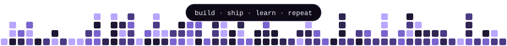

<div align="center">



<a href="https://git.io/typing-svg"></a>

</div>

---

### 👾 About

I'm **Kepar** (Vova) — a product builder from Ukraine. I co-founded a bootstrapped business in the Telegram ecosystem, and I build the tools behind it: bots, Mini Apps, SaaS platforms and the automation that keeps them running.

My sweet spot is the full loop — **figuring out what to build, designing how it works, shipping it, and growing it**.

```yaml
role:      product builder · co-founder · CTO of my own projects
focus:     Telegram ecosystem, EdTech, automation, desktop utilities
workflow:  architecture docs → tickets → AI coding agents → review → ship
currently: building LingoPop, automating my Telegram channel network
```

### 🧩 Featured work

<p align="center">
  <a href="https://github.com/Kepar1337/Dark-Light"></a>
  <a href="#-featured-work"></a>
</p>
<p align="center">
  <a href="#-featured-work"></a>
  <a href="https://t.me/myrnyy_ua"></a>
</p>

> Most of my work lives in private repos — that's why the green squares outnumber the public projects. 🙂

### 🛠️ Toolbox

<p align="center">
  <br/>
  
</p>

<table>
<tr>
<td width="33%" valign="top">

**🧠 Product**
- Idea → scope → MVP
- Funnels & payments
- Analytics & growth loops

</td>
<td width="33%" valign="top">

**⚙️ Build**
- Telegram bots (grammY, Telethon)
- Mini Apps & PWAs
- Multi-tenant SaaS

</td>
<td width="33%" valign="top">

**🚀 Ship**
- Docker, VPS, serverless
- CI with GitHub Actions
- AI-agent development flow

</td>
</tr>
</table>

### 🐍 A year of shipping

<picture>
  <source media="(prefers-color-scheme: dark)" srcset="https://raw.githubusercontent.com/Kepar1337/Kepar1337/output/github-snake-dark.svg"/>
  <source media="(prefers-color-scheme: light)" srcset="https://raw.githubusercontent.com/Kepar1337/Kepar1337/output/github-snake.svg"/>
  
</picture>

### 📬 Let's build something

<p>
  <a href="https://t.me/myrnyy_ua"></a>
  <a href="mailto:tg.colab@gmail.com"></a>
</p>

Open to collaborations on **Telegram products, EdTech and automation**. If you have an idea that needs a builder — ping me.

<div align="center">
  <br/>
  
</div>
